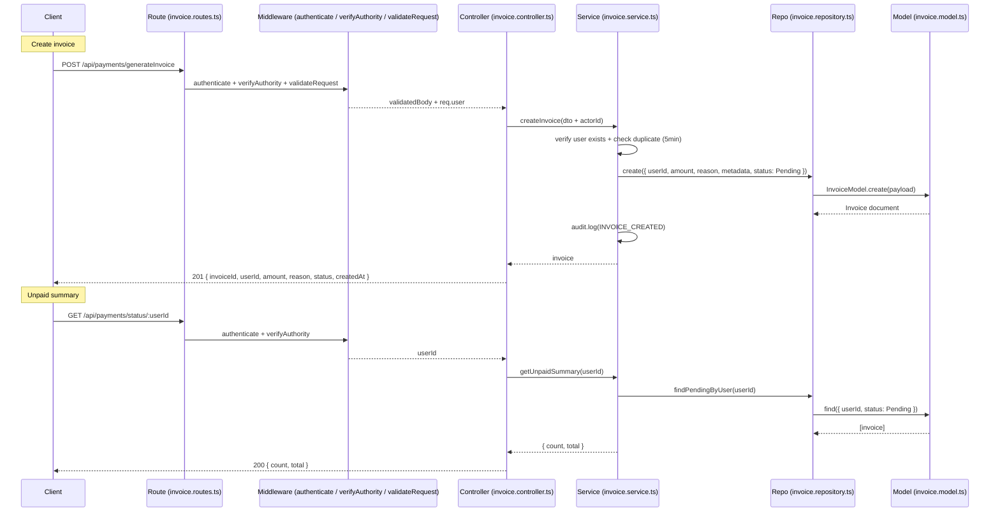

# Payment Module — Phase 1 Implementation Log

Imagine a collector on shift who notices a bin over its weight limit. They log in, their role gives them authority, and they submit a charge for the resident behind that bin. The request enters our server at `/api/payments/generateInvoice`, passes authentication and role checks, and is validated so we never create a bad invoice. Behind the scenes, we first confirm that the resident (by Mongo `_id`) actually exists and that we haven’t already created the same kind of invoice in the last five minutes. If all is well, we create a single “Pending” invoice in Mongo and record an audit line with who created it and why. Later, when finance or an authority wants to know what this resident still owes, they hit `/api/payments/status/:userId`. The server quickly sums all of that resident’s “Pending” invoices and returns a simple `{ count, total }`. That’s Phase 1 in a nutshell: a tight, predictable flow with guardrails at each layer—routes and middleware ensure only valid, authorized requests get in; controllers normalize inputs and outputs; services enforce the business rules (user existence, dedupe, audit, transactions); repositories keep DB details clean; and the model stores exactly what we need, efficiently indexed for status and deduplication.

This document captures what changed in each file and the exact steps taken during Phase 1 (Invoice generation + unpaid status), including auth/roles wiring, validation, audit, and dedupe.

## Phase 1 scope

- Add server-side invoice flow with solid layering: Controller → Service → Repository → Model.
- Endpoints under `/api/payments`:
  - POST `/generateInvoice` (create pending invoice; audit + dedupe within 5 min)
  - GET `/status/:userId` (summary of unpaid invoices)
- Validation with Zod; authorize via `authenticate` + `verifyAuthority` (admin|authority|collector).
- Use Mongo `_id` as the sole user identifier; `userId` is an ObjectId on the model.
- Prepare for future Strategy/Observer without over-architecting.

---

## Compact sequence diagram



## Files changed and what actually changed

1. `server/src/modules/payment/models/invoice.model.ts`

- Created/ensured model with:
  - `userId: Types.ObjectId` (ref `User`, required, indexed)
  - `amount: number` (required)
  - `reason: string` (required, indexed)
  - `status: "Pending" | "Paid" | "Partially Paid" | "Refunded"` (indexed)
  - `metadata?: Mixed`, `dueDate?: Date`
  - timestamps; compound index `{ userId, reason, status, createdAt }` for quick dedupe/status queries.

2. `server/src/modules/payment/types/invoice.dto.ts`

- Added Zod schema `CreateInvoiceSchema`:
  - `userId: string` (ObjectId regex)
  - `amount: number` (> 0)
  - `reason: string` (min 3)
  - `metadata?: record<string, any>`
- Exported `CreateInvoiceDto` via `z.infer`.

3. `server/src/modules/payment/repositories/invoice.repository.ts`

- Implemented repository methods:
  - `create(data)`: now typed as `Partial<Omit<IInvoice, "userId">> & { userId: string | Types.ObjectId }`. If `userId` is a string, convert to `new Types.ObjectId()` before `InvoiceModel.create()`.
  - `findPendingByUser(userId: string)` → find by `userId` and `status: "Pending"`.
  - `findById(id)` and `updateStatus(id, status)`.
  - `findRecentPendingByUserAndReason(userId, reason, windowMs)` used for 5-minute dedupe window.

4. `server/src/modules/payment/services/audit.service.ts`

- Added a lightweight `AuditService.log(...)` that writes an `[AUDIT]` line to console with timestamp. Stub for future persistence.

5. `server/src/modules/payment/services/invoice.service.ts`

- Service orchestrating invoice creation and queries:
  - `calculateOverweight(actualWeight, allowedWeight)` → returns `{ excessKg, fee }` (LKR 250/kg example rate).
  - `applyDiscount(amount, discountPercent)` → clamps 0–100; returns `{ original, discountPercent, discountValue, total }`.
  - Private `isDuplicate(userId, reason)` → calls repo’s recent pending finder with a 5-minute window.
  - `createInvoice(input: CreateInvoiceDto & { actorId: string })`:
    - Checks user existence via `UserRepository.findById`.
    - Throws on duplicate within 5 minutes.
    - Wraps `repo.create(...)` and audit log in a session transaction pattern.
    - Logs `[AUDIT] INVOICE_CREATED` with `actorId`, `entityId`, and details.
  - `getUnpaidSummary(userId)` → aggregates pending invoices into `{ count, total }`.
  - Note: import path updated to `../services/audit.service` for clarity. TypeScript CLI build is green; if the editor flags a path error, restart TS server.

6. `server/src/modules/payment/controllers/invoice.controller.ts`

- `generateInvoice`:
  - Reads validated body from `(req as any).validatedBody` (Zod middleware), gets `actorId` from `(req as any).user?.id`.
  - Calls `service.createInvoice` and returns a normalized 201 response with invoice fields.
- `getUnpaidStatus` → calls `service.getUnpaidSummary(userId)`.

7. `server/src/modules/payment/routes/invoice.routes.ts`

- New router under `/api/payments`:
  - POST `/generateInvoice` with `authenticate`, `verifyAuthority`, `validateRequest({ body: CreateInvoiceSchema })` → `generateInvoice`.
  - GET `/status/:userId` with `authenticate`, `verifyAuthority` → `getUnpaidStatus`.

8. `server/src/middleware/verifyAuthority.ts`

- Extended roles to allow `admin`, `authority`, and `collector` to access protected payment endpoints.

9. `server/src/app.ts`

- Mounted the new payments router: `app.use("/api/payments", paymentsRouter);` which points to `invoice.routes.ts`.
- Includes standard middleware: JSON, cookies, CORS with `credentials: true`, metrics, rate limit, helmet, compression, and dev auth shim.

10. Compatibility fixes (to keep build green)

- `server/src/modules/payment/services/payment.service.ts`:
  - `getInvoices(userId)` now uses `invoiceRepo.findPendingByUser(userId)` (repo never had `findByResident`).
- `server/src/modules/payment/controllers/payment.Controller.ts`:
  - Path param renamed from `residentId` to `userId` and switched to `invoiceService.createInvoice` with `actorId` from `req.user`.
- `server/src/modules/payment/routes/payment.routes.ts`:
  - Updated GET path to `/:userId/invoices` for consistency.
- `server/src/modules/smart-bin/controllers/smartBin.controller.ts`:
  - Added stubs `startMaintenance` and `finishMaintenance` used by routes, so TypeScript compile passes.

---

## Endpoints and contracts

1. POST `/api/payments/generateInvoice`

- Auth: `authenticate` + `verifyAuthority` (admin|authority|collector)
- Body (validated by Zod):
  - `userId: string` (24-char hex ObjectId)
  - `amount: number` (> 0)
  - `reason: string` (min 3)
  - `metadata?: Record<string, any>`
- Behavior:
  - Verifies user exists.
  - Dedupe: if a Pending invoice exists for the same `userId+reason` in the last 5 minutes, request fails with 400 "Duplicate invoice detected".
  - Creates invoice (Pending), logs audit entry `{ actorId, action: INVOICE_CREATED, entityId, details }`.
- Response: `201` with
  - `invoiceId, userId, amount, reason, status, createdAt`.

2. GET `/api/payments/status/:userId`

- Auth: `authenticate` + `verifyAuthority` (admin|authority|collector)
- Response: `{ count: number, total: number }` summarizing user’s Pending invoices.

---

## Step-by-step log (what we did and why)

1. Model & DTO

- Created `invoice.model.ts` to store invoices with `userId:ObjectId` and indexing for performance and dedupe.
- Added `invoice.dto.ts` with Zod validations to fail fast and return consistent errors.

2. Repository & Service

- Implemented `invoice.repository.ts` with conversions from string `userId` to `ObjectId` and helper queries (pending, recent, by id, status update).
- Built `invoice.service.ts` to encapsulate business rules: verify user, dedupe window, optional transaction pattern, and audit logging.

3. Controller & Routes

- Added `invoice.controller.ts` exposing `generateInvoice` and `getUnpaidStatus`.
- Wired `invoice.routes.ts` with auth + role checks and request validation.

4. App wiring & roles

- Mounted the router under `/api/payments` in `app.ts`.
- Updated `verifyAuthority.ts` to include the `collector` role.

5. Compatibility updates to keep CI green

- Fixed `PaymentService.getInvoices` to use repo’s `findPendingByUser` and synced path params (`userId`) across controller and routes.
- Implemented SmartBin maintenance controller stubs referenced in routes so TypeScript compile succeeds.

6. Build & verification

- TypeScript build passes (`npm run build`).
- Note: Some editors may transiently flag the `audit.service` import; the CLI build is green. Restart the TS server if needed.

---

## Try it locally

Prereqs: Mongo running; server `.env` configured; ensure Node is compatible (server runs with Node 18+/20+; client/vite needs Node 20.19+ or 22.12+).

Server dev:

```powershell
# from server folder
npm install
npm run build
npm start
# or for live dev
npm run dev
```

Example request (after authenticating and with a role allowed by `verifyAuthority`):

```http
POST /api/payments/generateInvoice
Content-Type: application/json

{
  "userId": "64d2b9d9e7f5f93b9e6a1234",
  "amount": 1200,
  "reason": "Overweight waste"
}
```

Expected 201 response body (shape):

```json
{
  "invoiceId": "...",
  "userId": "...",
  "amount": 1200,
  "reason": "Overweight waste",
  "status": "Pending",
  "createdAt": "2025-10-19T..."
}
```

Status summary:

```http
GET /api/payments/status/64d2b9d9e7f5f93b9e6a1234
```

Returns:

```json
{ "count": 2, "total": 2400 }
```

---

## Notes / future work

- Persist audit logs (DB or external logger) and include contextual metadata (IP, request IDs).
- Add idempotency keys for invoice creation across network retries.
- Extend status endpoint to include detailed invoice list with pagination.
- Introduce Strategy for payment processing and Observer for notifications when moving beyond Phase 1.
